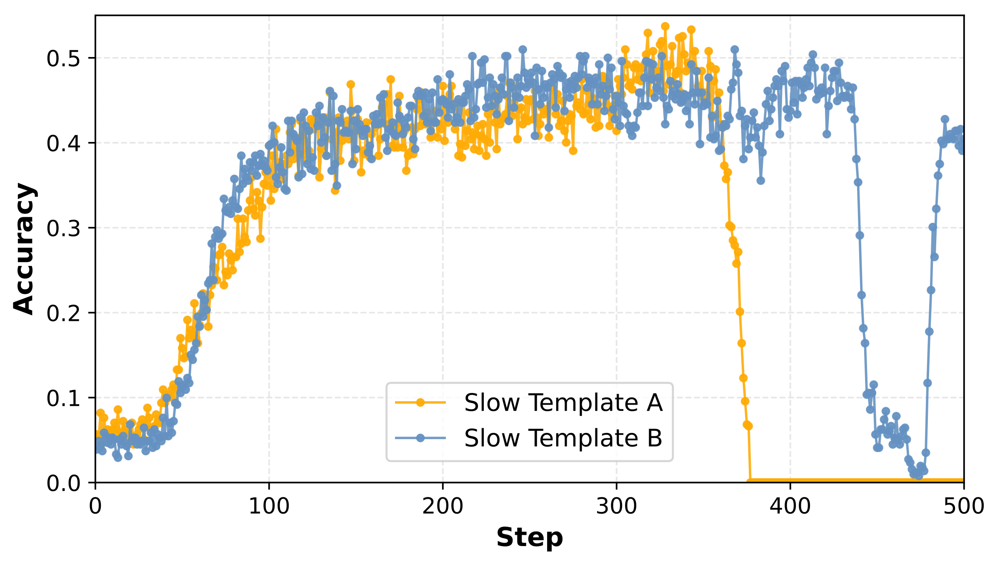
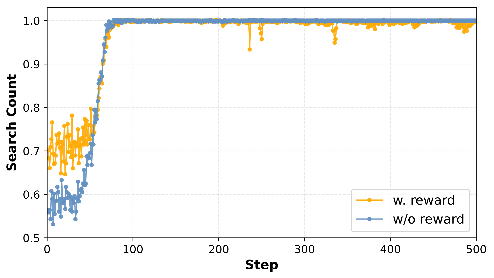
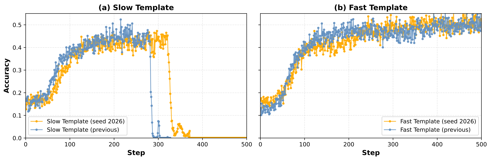
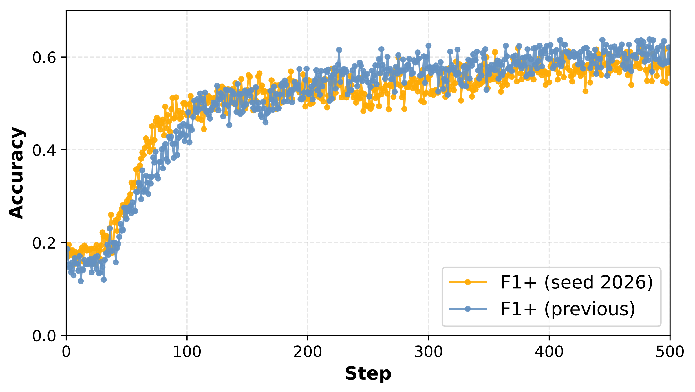
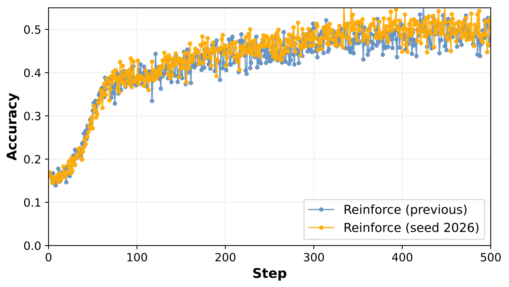

  

*Figure 1.* Training score of Qwen-7B under two **different Slow Thinking templates**. "Slow Template A" and "Slow Template B" denote two Slow Thinking templates that differ from the one used in the main paper.

| Template | NQ | TriviaQA | PopQA | HotpotQA | 2Wiki | Musique | Bamboogle | Avg. |
|---|:---:|:---:|:---:|:---:|:---:|:---:|:---:|:---:|
| Slow Thinking Template A (explicit steps) | 0.432 | 0.636 | 0.426 | 0.380 | 0.375 | 0.172 | 0.418 | 0.406 |
| Slow Thinking Template B (chain-of-thought) | 0.444 | 0.597 | 0.436 | 0.360 | 0.399 | 0.171 | 0.406 | 0.402 |
| Slow Thinking Template C (paper) | 0.451 | 0.620 | 0.434 | 0.361 | 0.386 | 0.163 | 0.406 | 0.403 |
| Fast Thinking template (Ours) | 0.463 | 0.640 | 0.458 | 0.427 | 0.360 | 0.156 | 0.453 | 0.422 |

*Table 1.* Performance comparison of three Slow Thinking templates and our Fast Thinking template. Templates A and B differ from the Slow Thinking template used in the main paper, denoted here as Template C.

---

  

*Figure 2.* Evolution of the **search count** for Qwen-3B under different settings. "w. reward" uses prompts with multiple search requirements and assigns corresponding rewards for multiple searches, whereas "w/o" uses the original strategy and reward. All other settings follow Section 3.1 (Experimental Setup) of the main paper.

---

  

*Figure 3.* Training score of **prompt templates** under different seed settings. Fig. (a) shows the training score under Slow Thinking template. "Slow Template (previous)" denotes the training setup used in the paper, where the seed is set to null, while "Slow Template (seed 2026)" denotes the result obtained with the seed fixed at 2026. Fig. (b) shows the training score under Fast Thinking template."Fast Template (previous)" denotes the training setup used in the paper, where the seed is set to null, while "Fast Template (seed 2026)" denotes the result obtained with the seed fixed at 2026.

  

*Figure 4.* Training score of **F1+** under different seed settings. "f1+(previous)" denotes the training setup used in the paper, where the seed is set to null ; "f1+(seed2026)" denotes the result obtained with the seed fixed at 2026.

  

*Figure 5.* Training score of **Reinforce** under different seed settings. "reinforce (previous)" denotes the training setup used in the paper, where the seed is set to null ; "reinforce (seed2026)" denotes the result obtained with the seed fixed at 2026.

---

| Policy | NQ | TriviaQA | PopQA | HotpotQA | 2Wiki | Musique | Bamboogle | Avg. |
|--------|----|----------|-------|----------|-------|--------|-----------|------|
| PPO (1-sample) | 0.463 | 0.641 | 0.455 | 0.427 | 0.357 | 0.156 | 0.453 | 0.422 |
| PPO (5-sample) | 0.438 | 0.641 | 0.422 | 0.484 | 0.390 | 0.187 | 0.390 | 0.422 |
| REINFORCE | 0.474 | 0.647 | 0.439 | 0.407 | 0.393 | 0.192 | 0.422 | 0.437 |
| GRPO | 0.460 | 0.636 | 0.440 | 0.419 | 0.401 | 0.178 | 0.422 | 0.433 |

*Table 2.* Comparison of PPO, GRPO, and REINFORCE under matched sampling settings. We additionally report PPO with five sampled responses to align it with GRPO and REINFORCE.
